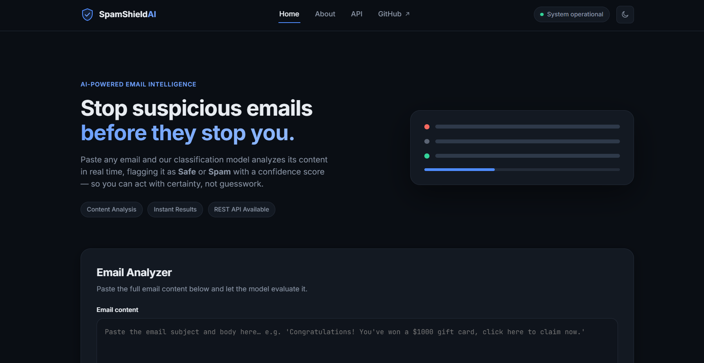
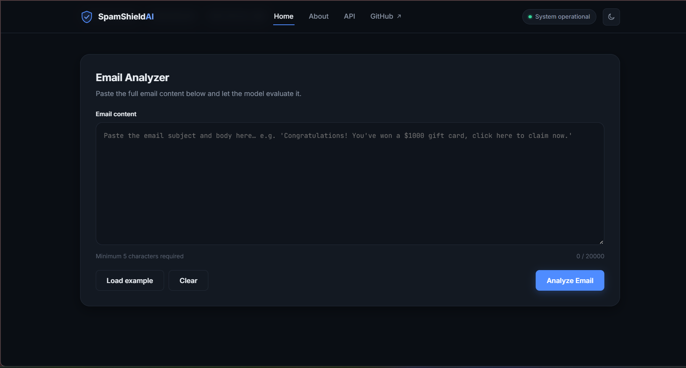
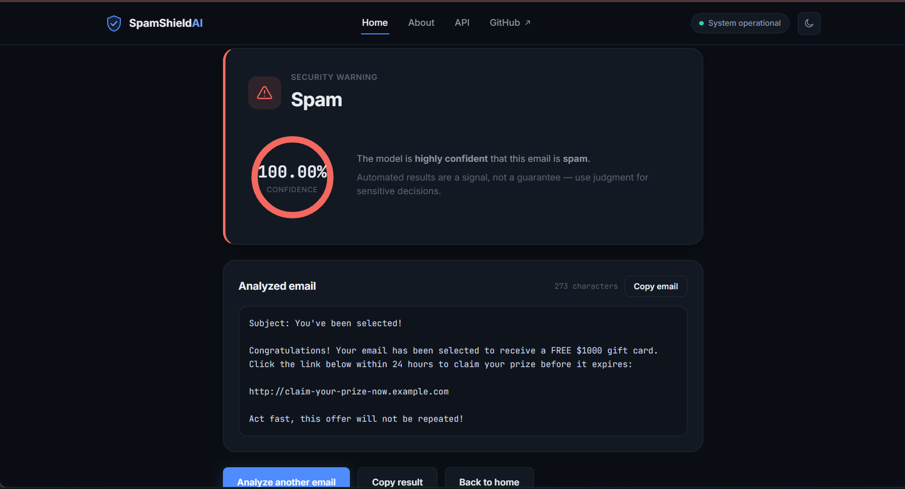
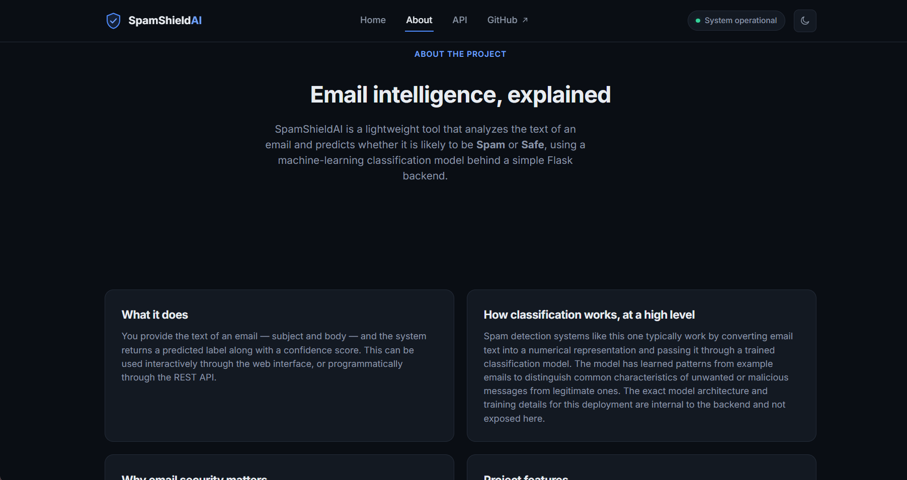
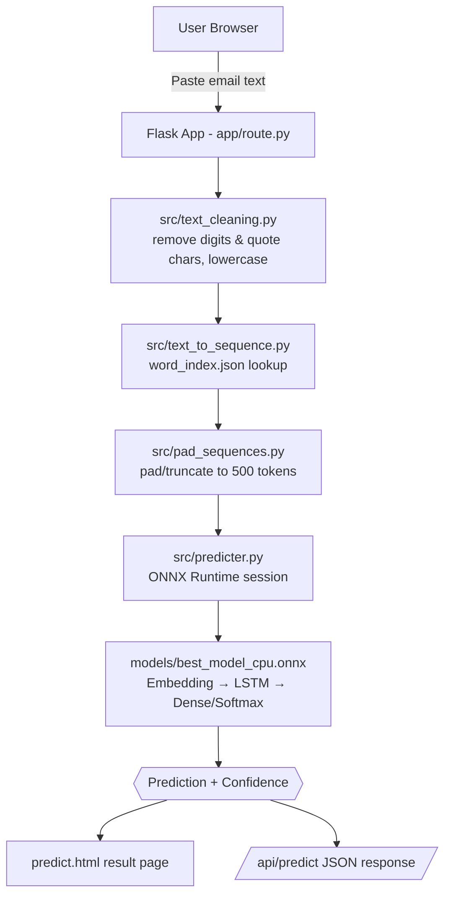

# 🛡️ SpamShieldAI

**A Flask web app that classifies pasted email text as Spam or Safe using an LSTM text-classification model, served through a REST API.**

SpamShieldAI lets you paste the subject/body of an email into a web UI (or POST it to a JSON API) and get back a `Spam` / `Safe` label with a confidence score. The model is a Keras Embedding→LSTM→Dense classifier trained on a merged public email/SMS/phishing dataset, exported to ONNX so it can run on CPU without a TensorFlow runtime in production.


---

## ✨ Features

| Feature | Description |
|---|---|
| 🧠 Email Classification | Paste raw email text and get a `Spam` / `Safe` prediction |
| 📊 Confidence Score | Every prediction ships with a softmax-derived confidence value |
| 🌐 Web Analyzer UI | A themed (dark/light) single-page analyzer with an example-email loader and character counter |
| 🔌 REST API | `POST /api/predict` for programmatic integration, no auth required |
| 💓 Health Check | `GET /api/health` for uptime monitoring |
| 📄 API Docs Page | `/api` renders live, human-readable endpoint documentation in-app |
| ℹ️ About Page | `/about` explains the project at a high level |

---

## 🖥️ Live Demo

🚀 **Live App:** [spamshieldai-wr09.onrender.com](https://spamshieldai-wr09.onrender.com/)
📦 **Repository:** [github.com/ajya97/SpamShieldAI](https://github.com/ajya97/SpamShieldAI)

> Note: the app is hosted on Render's free tier, so the first request after inactivity may take a few seconds to wake the service.

---

## 📸 Screenshots

> Screenshots are not yet committed to the repository. To add them, save the images under `docs/screenshots/` using the file names below and they will render here.

| Home / Hero | Predictor form |
|:---:|:---:|
|  |  |
| *Landing view with an illustrative example session* | *Grouped inputs with the live session mix* |

| Prediction result | About the model |
|:---:|:---:|
|  |  |
| *Verdict, probability meter and session metrics* | *Model card and API example* |

---

## 🧠 How It Works

```text
User pastes email text
        ↓
Flask route (/predict or /api/predict)
        ↓
Text cleaning (strip digits & quote characters, lowercase)
        ↓
Word-index tokenization (word_index.json)
        ↓
Sequence padding/truncation to 500 tokens
        ↓
ONNX Runtime inference (Embedding → LSTM → Dense/Softmax)
        ↓
Spam / Safe label + confidence score
        ↓
Rendered result page or JSON response
```

---

## 🏗️ System Architecture



---

## 🛠️ Tech Stack

| Category | Technology |
|---|---|
| Backend | Python, Flask 3.0.3 (application-factory pattern with a blueprint) |
| ML Model Format | ONNX, served via `onnxruntime` (`CPUExecutionProvider`) |
| Model Training | TensorFlow/Keras (`Embedding`, `LSTM`, `Dense`), converted with `tf2onnx` |
| NLP Preprocessing | Custom Python modules — regex-based cleaning, hand-rolled word-index tokenizer, NumPy padding |
| Frontend | Server-rendered Jinja2 templates, vanilla CSS (`style.css`, `animations.css`, `responsive.css`), vanilla JavaScript (`main.js`, `prediction.js`) |
| Database | None — the app is stateless; no database is used |
| Deployment | Render (Gunicorn WSGI server) |
| Dev Tools | Jupyter notebooks for data prep and model training |

---

## 📂 Project Structure

```text
SpamShieldAI/
├── Notebook/
│   ├── data_notebook.ipynb      # Merges the three raw datasets into one labeled CSV
│   └── model_notebook.ipynb     # Tokenizes text, trains the LSTM model, exports ONNX
├── app/
│   ├── __init__.py              # Flask app factory, blueprint registration, 404 handler
│   └── route.py                 # All routes: /, /predict, /api/predict, /api/health, /about, /api
├── dataset/
│   └── raw_data/
│       ├── CEAS_08.csv          # Raw email dataset (source data, not shipped as "clean")
│       ├── Phishing_Email.csv   # Raw phishing/legitimate email dataset
│       └── email.csv            # Raw SMS-style spam/ham dataset
├── models/
│   ├── best_model_cpu.onnx      # Trained classifier, exported for CPU inference
│   └── word_index.json          # Word → integer vocabulary used at inference time
├── src/
│   ├── predicter.py             # Loads the ONNX model and runs the prediction pipeline
│   ├── text_cleaning.py         # Removes digits and quote characters, lowercases text
│   ├── text_to_sequence.py      # Converts cleaned text into a word-index sequence
│   └── pad_sequences.py         # Pads/truncates sequences to a fixed length (500)
├── static/
│   ├── css/                     # style.css, animations.css, responsive.css
│   ├── js/                      # main.js, prediction.js (analyzer UI + result-page logic)
│   └── assets/logo.svg
├── templates/
│   ├── base.html                # Shared layout: navbar, theme toggle, footer
│   ├── index.html                # Home page with the email analyzer
│   ├── predict.html             # Result page with confidence visualization
│   ├── about.html                # About page
│   ├── api.html                  # In-app API reference page
│   └── 404.html
├── convert.py                   # Rebuilds a CPU-only Keras model and exports it to ONNX
├── requirements.txt
├── run.py                       # Entry point; exposes the `app` object for Gunicorn
└── README.md
```

---

## ⚙️ Installation

```bash
git clone https://github.com/ajya97/SpamShieldAI.git
cd SpamShieldAI

python -m venv venv
```

**Activate the virtual environment**

Windows:
```powershell
venv\Scripts\activate
```

Linux/macOS:
```bash
source venv/bin/activate
```

**Install dependencies**

```bash
pip install -r requirements.txt
```

`requirements.txt` includes:

```text
Flask==3.0.3
gunicorn==22.0.0
numpy
onnx
onnxruntime
```

> Model training (via the notebooks/`convert.py`) additionally requires `tensorflow`, `tf2onnx`, `scikit-learn`, `pandas`, `matplotlib`, and `seaborn`, which are **not** required to run the web app itself since a pre-trained ONNX model is already included in `models/`.

---

## 🔐 Environment Variables

No environment variables are required to run the Flask app locally or on Render — the model and vocabulary files are loaded from the `models/` directory at request time, and no API keys, secrets, or database URLs are used anywhere in the codebase.

---

## ▶️ Running Locally

```bash
python run.py
```

The app starts on `http://0.0.0.0:10000` (see `run.py`). Open it in your browser at:

```text
http://127.0.0.1:10000/
```

---

## 🔌 API Documentation

No authentication is required for either endpoint.

| Method | Endpoint | Purpose |
|---|---|---|
| GET | `/` | Home page with the email analyzer |
| POST | `/predict` | Form-based prediction, renders the `predict.html` result page |
| POST | `/api/predict` | JSON API — returns a prediction and confidence score |
| GET | `/api/health` | Health check for uptime monitoring |
| GET | `/about` | About page |
| GET | `/api` | Human-readable API reference page |

### `POST /api/predict`

**Request**

```json
{
  "email_text": "Congratulations! You have won a $1000 gift card, click here to claim now."
}
```

**Response**

```json
{
  "success": true,
  "prediction": "Spam",
  "confidence": 0.94
}
```

**Error response** (e.g. missing field)

```json
{
  "success": false,
  "error": "email_text is required"
}
```

### `GET /api/health`

```json
{
  "status": "healthy",
  "service": "Spam email Detector API"
}
```

---

## 🤖 Machine Learning Pipeline

```text
Raw datasets (CEAS_08.csv, Phishing_Email.csv, email.csv)
        ↓
Merge into one DataFrame with `body` and `label` (Spam/Safe) columns
        ↓
Lowercase, strip digits and quote characters, strip punctuation
        ↓
Keras Tokenizer → word-index vocabulary (saved as word_index.json)
        ↓
pad_sequences (max length 500, post-padding/truncation)
        ↓
Model: Embedding → LSTM(128 units) → Dense(2, softmax)
        ↓
Trained with Adam optimizer, categorical cross-entropy
        ↓
Exported to ONNX (opset 13/17) via tf2onnx for CPU-only inference
        ↓
onnxruntime.InferenceSession loads the .onnx model at prediction time
```

**Dataset.** Three raw sources — `CEAS_08.csv`, `Phishing_Email.csv`, and `email.csv` (an SMS-style spam/ham dataset) — are combined in `Notebook/data_notebook.ipynb` into a single `body` / `label` dataset, with labels normalized to `Spam` or `Safe`.

**Inference-time preprocessing.** At request time (`src/`), text is cleaned (`text_cleaning.py`), converted to a sequence of vocabulary IDs using the saved `word_index.json` (`text_to_sequence.py`), and padded/truncated to 500 tokens (`pad_sequences.py`) — mirroring the preprocessing used at training time.

**Model architecture.** Per `convert.py` and the training notebook, the classifier is a simple `Embedding → LSTM → Dense(2, softmax)` network. The Keras model is rebuilt with CPU-compatible LSTM settings and converted to ONNX so the deployed app can run inference with `onnxruntime` alone, without a TensorFlow dependency in production.

**Training details found in the notebook.** The training run visible in `Notebook/model_notebook.ipynb` uses a very small held-out split (`test_size=0.001`) and trains for a single epoch (`epochs=1`, `batch_size=8`). This is best understood as a working prototype pipeline rather than a rigorously validated training run — see [Model Performance](#-model-performance) below.

---

## 📊 Model Performance

> Model performance metrics (accuracy, precision, recall, F1, etc.) are not documented in the repository. The training notebook computes `accuracy_score` on a very small held-out split, but no metrics, evaluation report, or confusion matrix are saved or published alongside the model.

---

## 🧪 Testing

No automated test suite (e.g. `pytest`) is present in the repository. The included **Deployment checklist** describes the manual verification approach used before deploying:

- `pip install -r requirements.txt` succeeds locally
- `python run.py` serves the home page, analyzer, and result page correctly
- `/api/health` returns `{"status": "healthy", ...}`
- `/about` and `/api` render correctly
- Static assets load without 404s
- A real spam-like email and a real safe-like email are tested end to end

Example manual API test:

```bash
curl -X POST http://127.0.0.1:10000/api/predict \
  -H "Content-Type: application/json" \
  -d '{"email_text": "Congratulations! You have won a prize, click here now."}'
```

---

## 🚀 Deployment

- **Hosting platform:** [Render](https://render.com)
- **Live URL:** https://spamshieldai-wr09.onrender.com/
- **Build command:** `pip install -r requirements.txt`
- **Start command:** `gunicorn run:app`
- **Python version:** pinned via `runtime.txt` (or Render's dashboard Python-version setting)
- **Environment variables:** none required

---

## 🔮 Future Improvements

These are potential enhancements, not existing features:

- Rigorous train/validation/test split with documented, reproducible accuracy/precision/recall metrics
- Caching the ONNX inference session instead of re-loading it on every request
- Automated tests (unit tests for `src/` preprocessing, integration tests for the API)
- Larger and more diverse training data with de-duplication across the three source datasets
- Input rate limiting on the public API endpoints
- CI/CD pipeline for automated testing and deployment
- Dockerized deployment for environment consistency
- Model monitoring/drift detection in production

---

## 🤝 Contributing

Contributions are welcome:

1. Fork the repository
2. Create a feature branch: `git checkout -b feature/your-feature`
3. Commit your changes: `git commit -m "Add your feature"`
4. Push to the branch: `git push origin feature/your-feature`
5. Open a Pull Request describing your changes

Please keep the existing `/predict`, `/api/predict`, and `/api/health` contracts (`email_text` / `prediction` / `confidence`) unchanged unless a PR explicitly discusses a breaking change.

---

## 📄 License

> No license has currently been specified for this project.

---

## 👨‍💻 Author

**Ajeet Yadav** ([@ajya97](https://github.com/ajya97))

- GitHub: [github.com/ajya97](https://github.com/ajya97)
- LinkedIn: [linkedin.com/in/ajya97](https://www.linkedin.com/in/ajya97)
- Portfolio: [ajya97.github.io/mini-project/port.html](https://ajya97.github.io/mini-project/port.html)

---

## ⭐ Support

If you found SpamShieldAI useful or interesting, consider starring ⭐ the repository and forking it to build on top of it — feedback and pull requests are always appreciated.